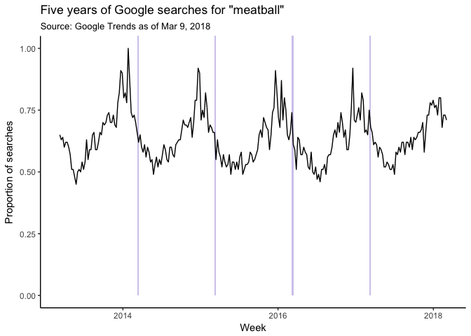

Popularity of searches for Meatball and how that relates to National Meatball Day
================
Kevin "lil Sweet" Thompson
3/9/2018

National Meatball Day
=====================

It turns out, [that's a real thing](https://www.google.com/search?q=international+meatball+day&oq=international+meatball+day&aqs=chrome..69i57j0.3576j0j7&sourceid=chrome&ie=UTF-8).

But strangely, it appears that searches for meatball are not as popular during the week of National Meatball day as they are during other parts of the year.

``` r
library(tidyverse)
library(lubridate)
mb <- read_csv("meatball.csv", skip=3, col_names = c("week", "count"), col_types = cols(week=col_date(), count=col_integer()))
herokuLight <- "#D3CBED"
```

``` r
plot <- mb %>%
  ggplot(aes(x=week, y=count/100)) +
  
  ## This is ugly. There has to be a better way to shade the weeks where meatball day fell
  geom_rect(fill=herokuLight, aes(ymin=0, ymax=Inf, xmin=ymd("2014-03-09"), xmax=ymd("2014-03-16"))) + 
  geom_rect(fill=herokuLight, aes(ymin=0, ymax=Inf, xmin=ymd("2015-03-08"), xmax=ymd("2015-03-15"))) +
  geom_rect(fill=herokuLight, aes(ymin=0, ymax=Inf, xmin=ymd("2016-03-06"), xmax=ymd("2016-03-13"))) +
  geom_rect(fill=herokuLight, aes(ymin=0, ymax=Inf, xmin=ymd("2017-03-05"), xmax=ymd("2017-03-12"))) +
  
  geom_line(stat="identity") +
  theme_light() +
  scale_y_continuous() + 
  labs(title="Five years of Google searches for \"meatball\"",
       subtitle = "Source: Google Trends as of Mar 9, 2018",
       y="Proportion of searches",
       x="Week")
print(plot)
```



``` r
ggsave(plot, filename="meatball.png")
```

    ## Saving 7 x 5 in image
